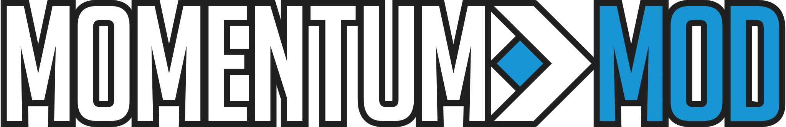

> _Momentum Mod's game User Interface files used by the Strata Source Engine's Panorama UI framework._

# Structure

The repository primarily consists of XML, SCSS and JavaScript/TypeScript files. It also includes all icons and various images and videos used by the UI.

For a general overview of Panorama, see the [VDC page](https://developer.valvesoftware.com/wiki/Panorama).

## XML

XML, found in the `layout/` folder, is used to describe the overall _layout_ of all panels. These panels can then be manipulated by JavaScript and C++ code.

## CSS/SCSS

Panorama uses a variant of CSS for styling. Note that it does _not_ conform to the standard CSS spec, differing majorly in how it handles things like flow and scaling. A complete list of CSS properties can be found using `dump_panorama_css_properties markdown` in the ingame console (you will need to launch with -condebug and read the console.log output). The list is also kept on the [VDC](https://developer.valvesoftware.com/wiki/CSGO_Panorama_CSS_Properties) though this may not be fully up to date.

Momentum uses the [Sass](https://sass-lang.com/) preprocessor for all styling. This is compiled by the game itself on first load then cached for future loads if unchanged. Developers may therefore change any Sass styling and it will be recompiled on next launch or reload with `panorama_reload`, which is by default bound to F7.

The Sass module structure, found in `styles/`, is quite conventional, with all top-level modules (besides `abstract/`) handled by `main.scss`. Any XML file then needs only include `main.scss` to access the entirety of the styling. We use the [BEM](http://getbem.com/) (Block Element Modifier) naming scheme for all classes, besides those that are referenced in C++ code, which use UpperCamelCase.

## JavaScript/TypeScript

Panorama uses the [V8 JavaScript engine](https://v8.dev) to interpret and run the JavaScript files, found in `scripts/`, at runtime, which are included in XML files within `<scripts>` tags (similar to regular web development).

We also support TypeScript - any `.ts` file `scripts/` are compiled to corresponding JavaScript files in `scripts_dist/`, whilst `.js` are just copied over. Note that we don't use any kind of import/module/bundling system as it's not supported in engine code. Instead we just declare the same XML `<scripts>` tags and scripts get the same scope (yeah, old school). Use `/// <reference path="foo.ts" />` to keep TypeScript happy.

JavaScript communicates with the game via events and APIs exposed by the game. The [pano-typed](https://github.com/StrataSource/pano-typed) package (submoduled in `scripts/types/`) which provides types and documentation for the exposed APIs and events. These are updated manually, and some things may be missing. A full list of which can be found by running `dump_panorama_events markdown` and `dump_panorama_js_scopes markdown` in-game (best to the game in `-condebug` and read `momentum/console.log`). Feel free to add any APIs/events to the `pano-typed` package! If anything is missing completely, please contact us in Discord and we can check in engine code for you.

# Setup

#### Requirements

-   Git
-   [Node.js](https://nodejs.org/en/download/)

#### Recommendations

We highly suggest using @braem's [panorama-languages-support](https://marketplace.visualstudio.com/items?itemName=braemie.panorama-css) VSCode plugin for language support for Panorama's version of CSS

### Guide

The easiest way to develop for Momentum Mod Panorama is to fork this repository and mount it in your `momentum/custom/` folder, for example:

```bash
cd <Your Steam Momentum Mod or Momentum Mod Playtest install location>\momentum\custom\
mkdir PanoramaDev
cd PanoramaDev
git clone https://github.com/<your github account>/panorama.git
```

You should end up with `momentum/custom/PanoramaDev/panorama` containing the contents of this repository.

This will be mounted on game launch and override the files in your `momentum/panorama/` folder. To avoid any overlaps (e.g. if your branch renames or moves a file, the original file will still be mounted), you may want to temporarily rename your `momentum/panorama/` folder. (_NOTE: you'll need to do this after each Momentum Mod Steam update!_)

Install [Node.js](https://nodejs.org/en/download/) if you don't have it
already, then in a terminal run:

`npm install`

This will install necessary dev dependencies and setup commit hooks which will lint and auto-format your code on commit.

You will need to run:

`npm run build`

at least once to compile JS/TS scripts to JS, and after any changes to files in `scripts/`. Use watch mode if you want to compile on change with

`npm run watch`

# Contributing

Most of our larger systems and components require significant work with (closed-source) game code and thus requires licensed C++ access or working tandem licensed C++ developer. Our work until now has been done internally by the core team. For 0.9.1 and onwards, we have exposed enough events and APIs that non-team developers should be able to work on areas like HUD components (for an example of non-licensed HUD work, we recommend [`scripts/hud/cgaz.js`](scripts/hud/cgaz.js)). We will continue to expose data as we best see fit for custom panels.

Therefore, those looking to contribute should look for issues **NOT** marked with "Needs C++". We also greatly encourage you to check out the the #panorama channel in our [Discord](https://discord.gg/momentummod) - whilst Panorama itself is poorly documented, we are happy to help any potential contributors further there!
